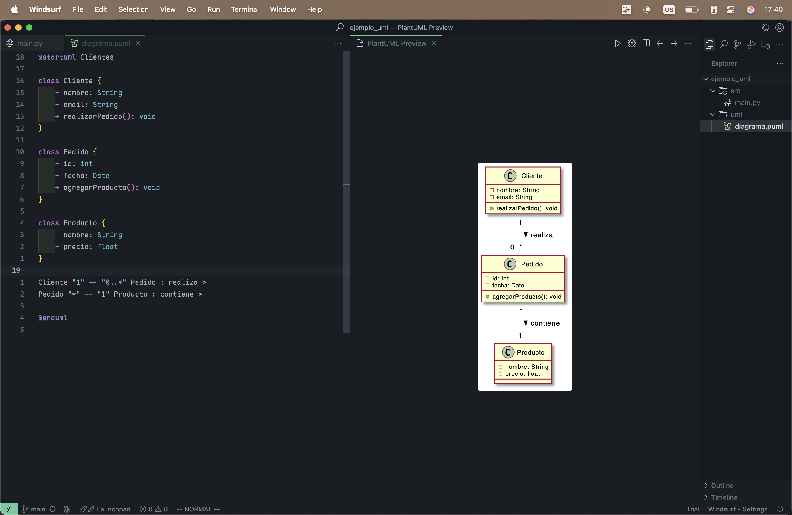
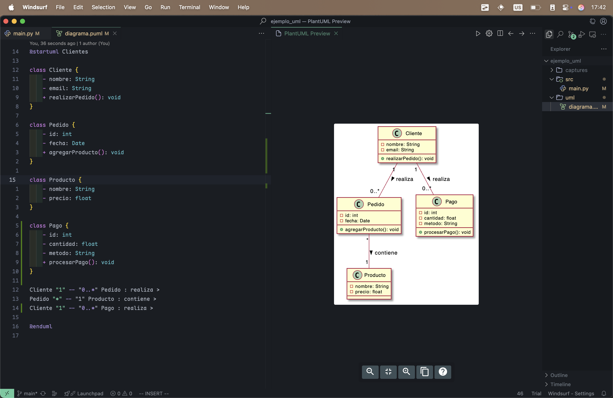

# Proyecto de ejemplo con UML y control de versiones

## 📌 Objetivo
Mantener sincronizados el diseño UML y el código fuente del proyecto mediante buenas prácticas colaborativas con Git.

---

## 🧭 Normas para actualizar el UML

- El diagrama UML debe reflejar siempre la estructura actual del código.
- Cada vez que se agregue, modifique o elimine una clase o relación importante, se debe actualizar el archivo `.puml` (o imagen `.png` generada).
- Usamos [PlantUML](https://plantuml.com/es/) para editar los diagramas.
- Las actualizaciones del UML deben hacerse en la misma rama donde se hace el cambio de código.

---

## ✅ Buenas prácticas para los commits

- Commits cortos pero descriptivos.
- Prefijo sugerido:
  - `feat:` para nuevas funcionalidades
  - `fix:` para correcciones
  - `uml:` para cambios en el diagrama UML
  - `docs:` para documentación

**Ejemplos:**
- `feat: Añadida clase Cliente con métodos básicos`
- `uml: Actualizado diagrama UML con clase Cliente`
- `docs: Añadido README con reglas del equipo`

---

## 🔄 Ciclo de trabajo recomendado

1. **Diseño (PlantUML):**
   - Editar el archivo `diagrama.puml` para definir nuevas clases o relaciones.
   - Exportar una imagen `.png` del diagrama si se necesita visualmente.
2. **Implementación:**
   - Programar las clases en el directorio `/src`.
3. **Sincronización:**
   - Ajustar el diagrama si el código evolucionó diferente al diseño.
4. **Commit y Push:**
   - Subir ambos cambios juntos a una rama nueva.
   - Crear un Pull Request (PR) para revisión.

---

## 📸 Capturas

### Antes del cambio:

### Después del cambio:

---

## 👤 Rol y decisiones

Mi rol en este ejercicio fue el de **diseñador**. Me encargué de mantener sincronizado el diseño UML con el código fuente y documentar el proceso para el equipo.

Decisiones:
- Usar PlantUML por su simplicidad y facilidad de integración en Git.
- Definir una estructura de proyecto clara para evitar conflictos.
- Establecer reglas de commits para facilitar la revisión.

